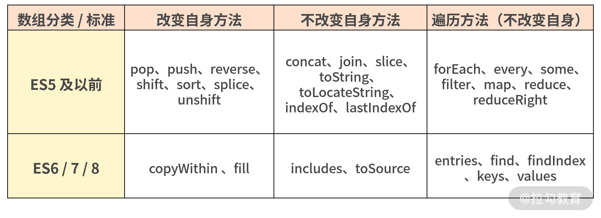

## 引言
截至 ES7 规范，数组共包含 33 个标准的 API 方法和一个非标准的 API 方法，使用场景和使用方案纷繁复杂，其中还有不少坑。

在学习之前先思考下面几个问题：

- 数组的构造器有那些?
- 数组改变自身的方法有哪些?
- 数组不改变自身的方法有哪些?
- 数组的遍历方法有哪些?


### Array的构造器
Array构造器是为了创造一个新的数组，在ES6之前创建一个新的数组常用的方式有构造函数和数组字面量
```js
//通过构造函数创建
var a = Array(3);
console.dir(a); // [empty × 3]
//数组字面量的方式
var b = [];
b.length = 3;
console.log(b); // [empty × 3]
```

ES6中新增的构造方法：Array.of()和Array.from()

**Array.of**

Array.of用于将参数依次转换为数组的每一项，`然后返回这个新数组`，不管这个参数是数字还是其他类型。与构造器唯一的区别是在于单个数字参数上面的差异
当参数是一个数字时，Array.of 会把参数变成数组里的一项，而构造器则会生成长度和第一个参数相同的空数组
```js
Array.of(2, 'a') // [2,'a']
Array(2, 'a') // [2, 'a']
Array.of(2) // [2]
Array(2) // [empty × 2]
```

**Array.from**

Array.from就是一个从类似数组的可迭代对象中创建一个新的,浅拷贝的数组实例，不改变原对象.

从语法上看，Array.from()有三个参数：
	1.类似数组的对象，必选;
	2.自定义加工函数，可选;
	3.this作用域，表示加工函数执行时的this值,可选
从下面的例子可以加深一下理解
```js
var obj = {0: 'a', 1: 'b', 2:'c', length: 3}
const arr = Array.from(obj, function(value, index){
	console.log(value, index, this, arguments.length)
	return value.repeat(3)
}, obj)
console.log(arr) // ['aaa', 'bbb', 'ccc']
```

如果不指定this的话，加工函数完全可以是箭头函数
```js
const arr = Array.from(obj, (value) => value.repeat(3))
```

拥有迭代器的对象还包括String，Set，Map等，Array.from都可以处理，如下
```js
Array.from('abc') // ['a', 'b', 'c']

Array.from(new Set(['aa', 'bb', 'cc', 'cc'])) // ['aa', 'bb', 'cc']

Array.from(new Map([[1, 'a'], [2, 'b'], [3, 'c']])) // [[1, 'a'], [2, 'b'], [3, 'c']]
```

**Array的判断方法isArray()**

Array.isArray()方法是判断一个变量是否是数组类型，在ES6之前，有以下方法可以判断是否是数组
```js
var arr = []
arr instanceof Array	// true
arr.constructor === Array	//true
Array.prototype.isPrototypeOf(arr) // true
Object.getPrototypeOf(arr) === Array.prototype //	true
Object.prototype.toString.call(arr) === '[Object, Array]' //true
```

ES6中新增了Array.isArray()方法来判断变量是否是数组，
```js
Array.isArray(arr) // true
```

>如果isArray不存在，MDN中polyfill有替代写法
```js
if(!Array.isArray()) {
	Array.isArray = function(arg){
		Object.prototype.toString().apply(arg) === '[Object, Array]'
	};
}
```

数组的概念说完了，下面学习一下数组的基本方法

### 改变自身的方法
基于ES6，会改变数组自身的方法有9个，分别是pop, push, reverse, shift, sort, splice, unshift, 以及ES6新增的copyWithin和fill

先查看下面的实列直观的感受下
```js
// pop - 移除数组最后一个元素,返回移除的元素
var arr = [1,2,3,4,5]
var item = arr.pop()
console.log(arr)	// [1,2,3,4]
console.log(item)	// 5

// push - 将一个元素插入到数组最后，返回数组的最新长度
var arr = [1,2,3,4]
var len = arr.push(5)
console.log(arr) // [1,2,3,4,5]
console.log(len) // 5

// reverse - 将数组元素反转过来显示，返回新数组
var arr = [1,2,3,4,5]
var arrNew = arr.reverse();
console.log(arr) // [5,4,3,2,1]
console.log(arrNew) // [5,4,3,2,1]

// shift - 移除数组第一个元素，返回该元素的值
var arr = [1,2,3,4,5]
var item = arr.shift()
console.log(arr) // [2,3,4,5]
console.log(item) // 1

// unshift - 将一个或多个元素添加到数组的开头,返回新数组的长度
var arr = [3,4,5]
var len = arr.unshift(1,2)
console.log(arr) // [1,2,3,4,5]
console.log(len) // 5

// sort - 默认排序顺序是在将元素转换为字符串，然后比较它们的UTF-16代码单元值序列时构建的,返回数组
var arr = ['a', 'Apple', 'b', 4]
arr.sort()
console.log(arr) // [4, 'Apple', 'a', 'b']

// splice - 删除或替换现有元素或者原地添加新的元素来修改数组,并以数组形式返回被修改的内容
var arr = ['a', 'b', 'c', 'd']
var rm = arr.splice(1, 2, 'good')
console.log(arr) // ['a', 'good', 'd']
console.log(rm) // ['b', 'c']

// copyWithin - 方法浅复制数组的一部分到同一数组中的另一个位置，并返回它，参数(target, start, end),end省略的话一直复制到数组末尾
var arr = [1,2,3,4,5]
var cp = arr.copyWithin(0,2)
console.log(arr) // [3,4,5,3,4]
console.log(cp) // [3,4,5,4,5]

// fill - 用一个固定值填充一个数组中从起始索引到终止索引内的全部元素。不包括终止索引。arr.fill(value[, start[, end]])
var arr = [1,2,3,4,5]
var fi = arr.fill(0, 3)
console.log(arr) // [1,2,3,0,0]
console.log(fi) // [1,2,3,0,0]

```

### 不改变自身的方法
基于 ES7，不会改变自身的方法也有 9 个，分别为 concat、join、slice、toString、toLocaleString、indexOf、lastIndexOf、
未形成标准的 toSource，以及 ES7 新增的方法 includes。
```js
// concat - 拼接数组
var arr = [1,2,3,4]
var arrNew = arr.concat(5, [6,7])
console.log(arr) // [1,2,3,4]
console.log(arrNew) // [1,2,3,4,5,6,7]

// join - 所有元素连接成一个字符串并返回这个字符串
var arr = [1,2,3,4]
var arrNew = arr.join('+')
console.log(arrNew) // '1+2+3+4'

// slice - arr.slice([begin[, end]])返回一个新的浅拷贝数组
var arr = [1,2,3,4]
var arrNew = arr.slice(2)
console.log(arrNew) // [3,4]

// toString - 返回字符串
var arr = [1,2,3,4]
var arrNew = arr.toString()
console.log(arrNew) // 1,2,3,4

// toLocaleString - 
var arr = [{name:'zz'}, 123, "abc", new Date()]
var arrNew = arr.toLocaleString()
console.log(arrNew) // [object, object] , 123, "abc", 2021/1/28 下午3:04:32

// indexOf - 正序寻找元素的下标
var arr = [1,4,3,4,5]
var index = arr.indexOf(4)
console.log(index) // 1

// lastIndexOf - 倒叙寻找元素的下标
var arr = [1,4,3,4,5]
var index = arr.lastIndexOf(4)
console.log(index) // 3

// toSource - 未形成标准，暂忽略

// includes - 判断一个数组是否包含一个指定的值，根据情况，如果包含则返回 true，否则返回false
var arr = [1,4,3,4,5]
var flag = arr.includes(3)
console.log(flag) // true
```

### 遍历的方法
基于 ES6，不会改变自身的遍历方法一共有 12 个，分别为 forEach、every、some、filter、map、reduce、reduceRight，
以及 ES6 新增的方法 entries、find、findIndex、keys、values
```js
// forEach, 遍历数组，但是不返回原数组
var arr = [1,2,3,4]
arr.forEach(function(value,index,arr){
	arr[index] = value + 1;
})
console.log(arr) // [2,3,4,5]

// every - 测试一个数组内的所有元素是否都能通过某个指定函数的测试。它返回一个布尔值。注意：若收到一个空数组，此方法在一切情况下都会返回 true
var arr = [1, 2, 3, 4]
var isExist  = arr.every(function(value, index, arr){
	 return isExist > 0
})
//或者
var isExist = arr.every(item => item > 0)
console.log(isExist) // true

// some - 判断是否至少一个元素通过了函数测试，返回的是一个Boolean值,注意：若收到一个空数组，此方法在一切情况下都会返回 false
var arr = [1, 2, 3, 4]
var isExist = arr.some(item => item % 2 === 0)
console.log(isExist) //true

//filer - 创建一个新数组, 其包含通过所提供函数实现的测试的所有元素。 
var arr = [0, 1, false, true, NaN, '', 'a', {}, undefined, null]
var arrNew = arr.filter(item => item)
console.log(arrNew) // [1, true, "a", {}]

//map - 创建一个新数组，其结果是该数组中的每个元素是调用一次提供的函数后的返回值。
var arr = [1,2,3,4]
var arrNew = arr.map(item => item * 2)
console.log(arrNew) // [2,4,6,8]

//手动实现map函数
function map(arr, mapCallback) {
	if(!Array.isArray(arr) || !arr.length || typeof(mapCallback)!== 'function') 
		return [];
	let result = [];
	for(var i = 0; i < arr.length; i++){
		result.push(mapCallback(arr[i],i))
	}
	return result;
}
map([1,2,3], function(a,b){return a+b;})

// reduce - arr.reduce(callback(accumulator, currentValue[, index[, array]])[, initialValue]),
//注意没有initialValue，index是从1开始
var arr = [{name: 'one'}, {name: 'two'}, {name: 'three'}]
var arrNew = arr.reduce(function(pre,curr,index,arr){
	if(index === 0){
		return curr.name
	}else if( index === arr.length -1) {
		return pre + '&' + curr.name
	}else {
		return pre + ',' + curr.name
	}
}, '')
console.log(arrNew) // one,two&three

//手动实现reduce函数
function reduce(arr, reduceCallback, initValue) {
	if(!Array.isArray(arr) || !arr.length || typeof(reduceCallback) !== 'function')
		return [];
	var hasInitValue = true;
	if(initValue === undefined || initValue === null)
		hasInitValue = false;
	var value = hasInitValue ? initValue : arr[0];
	for(var i = hasInitValue ? 1 : 0; i < arr.length; i++) {
		value = reduceCallback(value, arr[i], i, arr);
	}
	return value;
}

//find -返回查找到的值， findIndex - 返回查找到底的值底标
var arr = [1,2,3,4,5]
var item = arr.find(item => item > 4) // 5
var index = arr.findIndex(item => item > 4) // 4
```
要注意有些遍历方法不会返回处理之后的数组，比如 forEach；有些方法会返回处理之后的数组，比如 filter

### 总结
数组的基础 API 简单做了个总结表格

以上，数组的各方法基本讲解完毕，这些方法之间存在很多共性，如下：

 - 所有插入元素的方法，比如 push、unshift 一律返回数组新的长度；

 - 所有删除元素的方法，比如 pop、shift、splice 一律返回删除的元素，或者返回删除的多个元素组成的数组；

 - 部分遍历方法，比如 forEach、every、some、filter、map、find、findIndex，它们都包含 function(value,index,array){} 和 thisArg 这样两个形参。


