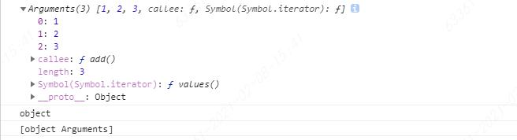

## 引言
在JavaScript中存在类数组，在平时的学习和面试中也会遇到类数组的情形，学习类数组可以更好的掌握数组知识和API运用

我们先来看看在 JavaScript 中有哪些情况下的对象是类数组呢？主要有以下几种：

 - 函数里面的参数对象 arguments；

 - 用 getElementsByTagName/ClassName/Name 获得的 HTMLCollection；

 - 用 querySelector 获得的 NodeList。

在课程开始前请你先思考几个问题：

 - 类数组是否能使用数组的方法呢？

 - 类数组有哪些方式可以转换成数组？


### 类数组基本介绍

##### arguments
下面重点介绍一下arguments,我们在日常开发中经常会遇到各种类数组对象，最常见的便是在函数中使用的 arguments，它的对象只定义在函数体中，包括了函数的参数和其他属性。
我们通过一段代码来看下 arguments 的使用方法，如下所示。
```js
function add() {
	console.log(arguments);
	console.log(typeof arguments);
	console.log(Object.prototype.toString.call(arguments));
}
add(1,2,3)
```
显示截图如下


从结果中可以看到，typeof 这个 arguments 返回的是 object，通过 Object.prototype.toString.call 返回的结果是 '[object arguments]'，
可以看出来返回的不是 '[object array]'，说明 arguments 和数组还是有区别的

### 类数组应用场景
我在这里为你介绍三种场景，这些也是最常见的。
##### 1.遍历参数操作
```js
function add() {
	var sum = 0;
	for(var i = 0; i< arguments.length; i++) {
		
		sum += arguments[i];
	}
	console.log(sum);
	return sum;
}
add(1) // 1
add(1,2) // 3
add(1,2,3) // 6
...
```

##### 2.定义链接字符串函数
我们可以通过 arguments 这个例子定义一个函数来连接字符串。这个函数唯一正式声明了的参数是一个字符串，该参数指定一个字符作为衔接点来连接字符串。该函数定义如下
```js
function myConcat(separa) {

  var args = Array.prototype.slice.call(arguments, 1);

  return args.join(separa);

}

myConcat(", ", "red", "orange", "blue");

// "red, orange, blue"

myConcat("; ", "elephant", "lion", "snake");

// "elephant; lion; snake"

myConcat(". ", "one", "two", "three", "four", "five");

// "one. two. three. four. five"
```

##### 3.传递参数使用
可以借助 arguments 将参数从一个函数传递到另一个函数，请看下面这个例子。
```js
function add(){
	foo.apply(this,arguments);
}

function foo(a,b,c) {
	console.log(a,b,c)
}

add(1,2,3) // 1,2,3
```

### 如何将类数组转换成数组

##### 1.类数组借用数组方法转数组
```js
function sum(a, b) {
  let args = Array.prototype.slice.call(arguments);
 // let args = [].slice.call(arguments); // 这样写也是一样效果
  console.log(args.reduce((sum, cur) => sum + cur));
}
sum(1, 2);  // 3
function sum(a, b) {
  let args = Array.prototype.concat.apply([], arguments);
  console.log(args.reduce((sum, cur) => sum + cur));
}
sum(1, 2);  // 3
```
这段代码中可以看到，还是借用 Array 原型链上的各种方法，来实现 sum 函数的参数相加的效果。
一开始都是将 arguments 通过借用数组的方法转换为真正的数组，最后都又通过数组的 reduce 方法实现了参数转化的真数组 args 的相加，最后返回预期的结果。

##### 2.ES6 的方法转数组
对于类数组转换成数组的方式，我们还可以采用 ES6 新增的 Array.from 方法以及展开运算符的方法。
那么还是围绕上面这个 sum 函数来进行改变，我们看下用 Array.from 和展开运算符是怎么实现转换数组的，请看下面一段代码的例子。
```js
function sum(a, b) {
  let args = Array.from(arguments);
  console.log(args.reduce((sum, cur) => sum + cur));
}
sum(1, 2);    // 3
function sum(a, b) {
  let args = [...arguments];
  console.log(args.reduce((sum, cur) => sum + cur));
}
sum(1, 2);    // 3
function sum(...args) {
  console.log(args.reduce((sum, cur) => sum + cur));
}
sum(1, 2);    // 3
```


