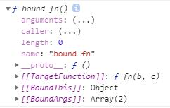

## JavaScript 面试知识点总结

本部分主要是笔者在复习 JavaScript 相关知识(ES6入门)和一些相关面试题时所做的笔记，如果出现错误，希望大家指出！

#### 目录
- [1.介绍js的数据类型](#1-介绍js的数据类型)
- [2.const与let和var的区别](#2-const与let和var的区别)
- [3.说下你理解的作用域和作用域链](#3-说下你理解的作用域和作用域链)
- [4.说说对于闭包的理解](#4-说说对于闭包的理解)
- [5.JS的执行上下文](#5-JS的执行上下文)
- [6.变量提升和函数声明提前](#6-变量提升和函数声明提前)
- [7.深拷贝和浅拷贝的理解](#7-深拷贝和浅拷贝的理解)
- [8.理解JSON的stringify和parse](#8-理解JSON的stringify和parse)
- [9.浏览器中的事件循环](#9-浏览器中的事件循环)
- [10.this指向的问题](#10-this指向的问题)
- [11.原型和原型链](#11-原型和原型链)
- [12.constuctor和typeof以及instanceof](#12-constuctor和typeof以及instanceof)
- [13.手动实现一个new方法](#13-手动实现一个new方法)
- [14.手动实现Call和Apply方法](#14-手动实现Call和Apply方法)
- [15.手动实现bind方法](#15-手动实现bind方法)
- [16.数组去重的方法](#16-数组去重的方法)
- [17.javaScript继承的几种方式及优缺点](#17-javaScript继承的几种方式及优缺点)
- [18.正则表达式和常用的正则表达式](#18-正则表达式和常用的正则表达式)
- [19.for...of与for...in的区别](#19-for-of与for-in的区别)
- [20.JS的事件循环 事件队列以及宏任务和微任务](#20-JS的事件循环-事件队列以及宏任务和微任务)
- [21.手写一个promise](#21-手写一个promise)
- [22.为什么使用 setTimeout 实现 setInterval？怎么模拟？](#22-为什么使用-settimeout-实现-setinterval怎么模拟)
- [23.JS中虚值或者假值？怎么判断？](#23-JS中虚值或者假值怎么判断)
- [24.简述前端事件流(事件机制)](#24-简述前端事件流或者事件机制)
- [25.JS事件委托](#25-JS事件委托)
- [26.闭包的应用之节流和防抖](#26-闭包的应用之节流和防抖)
- [27.继承的方式](#27-继承的方式)
- [28.ES5的继承和ES6的继承有什么区别](#28-ES5的继承和ES6的继承有什么区别)
- [29.模块化发展历程](#29-模块化发展历程)
- [30.ES6入门-变量的解构赋值](#30-ES6入门之变量的解构赋值)
- [31.ES6入门-函数形参的扩展及箭头函数](#31-ES6入门之函数形参的扩展及箭头函数)
- [32.ES6入门-第七种数据类型Symbol](#32-ES6入门之第七种数据类型Symbol)
- [33.ES6入门-Set和Map数据结构](#33-ES6入门之Set和Map数据结构)
- [34.ES6入门之Promise详解](#34-ES6入门之Promise详解)
- [35.如何封装一个 javascript 的类型判断函数](#35-如何封装一个-javascript-的类型判断函数)
- [36.简述一下原型和构造函数以及实例](#36-简述一下原型和构造函数以及实例)
- [37.原型修改和重写](#37-原型修改和重写)
- [38.原型链的终点时什么以及如何打印](#38-原型链的终点时什么以及如何打印)
- [39.use strict是什么和作用](#-39-use-strict是什么和作用)
- [40.JS中高阶函数浅析](#40-JS中高阶函数浅析)
- [99.Object有哪些属性方法](#99-Object有哪些属性方法)
- [100.Array有哪些属性方法](#100-Array有哪些属性方法)
-
-
-
-
-
-
-
-
-
-
-
-
-
-
-
-
-
-
-
-

#### 1. 介绍js的数据类型.
1. 
js 一共有六种基本数据类型，分别是 Undefined、Null、Boolean、Number、String，还有在 ES6 中新增的 Symbol 和 BigInt 类型。
Symbol 代表创建后独一无二且不可变的数据类型，它的出现我认为主要是为了解决可能出现的全局变量冲突的问题。
 - 新建的方式，不用new，var s = Symbol(). typeof s 为symbol
BigInt 是一种数字类型的数据，它可以表示任意精度格式的整数，使用 BigInt 可以安全地存储和操作大整数，即使这个数已经超出了 Number 能够表示的安全整数范围。
2. 
还有引用数据类型，Array，Function，Object
**[:arrow_up: 返回目录](#目录)**

#### 2. const与let和var的区别
**let和var声明的是变量，const声明的是常量**
常量：只能取值不能赋值，就是只读不写   
常量的声明：
```javascript
var es = 'ES6';
```
let和var的区别
① let不允许重复声明，var可以
```javascript
var str = 'es6';
var str = 'es2015';
console.log(str);


let es = 'es6';
let es = 'es2015';
console.log(es);    
//Uncaught SyntaxError: Identifier 'es' has already been declared
```
② let不属于顶层对象window,var可以
```javascript
let str = 'es6';
console.log(window.str);   //undefined
```
③ 不存在变量提升[5.JS的执行上下文](#JS的执行上下文)
```javascript
console.log(str);
let str = 'es2015';
//Uncaught ReferenceError: Cannot access 'str' before initialization

console.log(str);               var str;
var str = 'es2015';    =>       console.log(str);
                                str = 'es6';    
//结果是undefined，具体细节参照执行上下文分析								
```
④ 暂时性死区,在代码块内，使用let命令声明变量之前，该变量都是不可用的
```javascript
if(true) {
    console.log(str);
    let str = 'es6';//Uncaught ReferenceError: Cannot access 'str' before initialization
}
```
因为暂时性死区, 所以要特别注意typeof的使用
【拓展】
var的创建和初始化被提升，赋值不会被提升。
let的创建被提升，初始化和赋值不会被提升。
function的创建、初始化和赋值均会被提升。

⑤ 块级作用域
```javascript
if(true) {
    let str = 'es6';
}
console.log(str);
//Uncaught ReferenceError: str is not defined
```
###### let的特性const都有，不能重复声明、不存在变量提升、存在块级作用域也有暂时性死区，唯一的区别const声明常量，一旦声明无法修改。
###### 但是有一点特别注意，上面的列子中不能修改的都是基本数据类型，对于数组或者对象都是引用数据类型，引用数据类型可以修改的是存在堆内存中的数据
```javascript
const esObj = {
    name: 'es6',
    year: 2015
}
esObj.name = 'es2015';
console.log(esObj);


const arr = ['es6', 'es7', 'es8'];
arr[0] = 'es2015';
console.log(arr);
```
###### let定义的变量，只能在块作用域里访问，不能跨块作用域访问，也不能跨函数作用域访问,ES6新增的命令
###### var定义的变量，可以跨块作用域访问, 不能跨函数作用域访问,
###### const用来定义常量，创建时必须赋值，只能在块作用域里访问，并且不能修改引用数据类型的指向地址，但是可以修改引用数据指向地址内的数据。

[面试题](https://github.com/BGround/Web-Front-End-Interview/issues/5)

**[:arrow_up: 返回目录](#目录)**

#### 3. 说下你理解的作用域和作用域链
作用域是变量和函数的作用域范围和生命周期,当在当前作用域查找不到某变量时,就会去上层作用域查找，此行为一直找到全局对象window(非严格模式)，此查找的过程就是所谓的作用域链
PS:函数作用域的含义：属于这个函数的全部变量可以在整个函数的范围内使用及复用。

<font color=red>顺便理解下静态作用域和动态作用域</font>
*静态作用域指的是一段代码，在它执行之前就已经确定了它的作用域，简单来说就是在执行之前就确定了它可以应用哪些地方的作用域(变量)。
动态作用域–函数的作用域是在函数调用的时候才决定的*

```javascript
var a = 10;

function fn() {
    var b = 1;
    console.log(a + b);
}

fn(); // 11
```

*在创建fn函数时的时候就已经确定了它可以作用哪些变量，如果函数fn里面有变量a就直接操作变量a，如果没有就往上一级查找，这就是静态作用域*

```javascript
function foo() {
    console.log(a);
}

function bar() {
    var a = 3;
    foo();
}

var a = 2;
bar(); // 2;
```
*bar 调用，bar里面foo被调用，foo函数需要查找变量a，由于JavaScript是词法作用域(即静态作用域)，foo被解析时在全局作用域.
所以只能在全局作用域中找a,输出结果为2，而非bar作用域中的a。如果js采用的时动态作用域，那么foo在bar中调用，就会先在bar中查询a,输出为3。*

> ES6中let为javascript添加了块级作用域，

> 函数作用域：变量在定义的函数内及嵌套的子函数内处处可见；

> 块级函数域：变量在离开定义的块级代码后马上被回收。

**[:arrow_up: 返回目录](#目录)**

#### 4. 说说对于闭包的理解
闭包是指能够访问其他作用域自由变量的函数，即使该作用域已经销毁，理论上说在Javascript中Function都是闭包，
闭包无非满足以下两点：
>闭包首先得是一个函数。

>闭包能访问外部函数作用域中的自由变量，即使外部函数上下文已销毁。
```javascript
var name = "听风是风";
var obj = {
    name: "行星飞行",
    sayName: function () {
        return function () {
            console.log(this.name);
        };
    }
};
obj.sayName()(); // 听风是风
//这个可以改写成 
var fn = obj.sayName();
window.fn() // 所以this指向是window
```
** 这里主要涉及到函数的作用域和闭包的this指向问题**
> 函数作用域在定义时就已经确定了，而不是调用时确定

> this在最终调用时才确定，而不是定义时确定

[面试题](https://github.com/BGround/Web-Front-End-Interview/issues/1)
##### 闭包的用途
可以节流防抖，模拟私有属性和工厂函数等

参考链接：《[一篇文章看懂JS闭包，都要2020年了，你怎么能还不懂闭包？](https://www.cnblogs.com/echolun/p/11897004.html)》

**[:arrow_up: 返回目录](#目录)**

#### 5. JS的执行上下文
只有理解了 JavaScrip 的执行上下文，你才能更好地理解 JavaScript 语言本身，比如变量提升、作用域和闭包等.
```javascript
showName()
console.log(myname)
var myname = '极客时间'
function showName() { 
	console.log('函数showName被执行');
}
```
JS代码在执行前，JS引擎会做编译，编译完成之后才会进入到执行阶段.编译后会生成两部分内容：**执行上下文**和**可执行代码**
执行上下文是JavaScript执行一段代码时的运行环境,分为三种，**①全局执行上下文**，一般有浏览器创建为window对象，通过this访问,**②函数上下文**，可以存在无数个，每次调用函数就创建一个③eval上下文，很少用也不建议使用

`执行上下文`的创建阶段主要负责三件事：绑定this---创建词法环境组件(LexicalEnvironment)---创建变量环境组件(VariableEnvironment)
用伪代码表示：

```javascript
ExecutionContext = {  
    
    ThisBinding = <this value>, // 确定this的值
    
    LexicalEnvironment = {}, // 创建词法环境组件
    
    VariableEnvironment = {}, // 创建变量环境组件
};
```
**词法环境**，存let和const声明的变量，块级作用域就是通过词法环境的栈结构实现的，

**变量环境**，存var声明的变量，变量提升就是通过变量环境实现的


[思考题](https://github.com/BGround/Web-Front-End-Interview/issues/10)

参考链接：《[一篇文章看懂JS执行上下文](https://www.cnblogs.com/echolun/p/11438363.html)》    《[理解JavaScript 中的执行上下文和执行栈](https://www.muyiy.cn/blog/1/1.1.html)》

**[:arrow_up: 返回目录](#目录)**

#### 6. 变量提升和函数声明提前
变量提升的表现是，无论我们在函数中何处位置声明的变量，好像都被提升到了函数的首部，我们可以在变量声明前访问到而不会报错,*第五个问题已经说过*。
函数声明提前，类似于变量提升，但是有两种方法，区别在于是函数名提前吗，还是函数体提前
*通过 var fn=function(){}定义函数，只是将函数名提前了，函数体没有提前，如果在函数体前使用fn()调用函数就会报错*
```javascript
fn();
var fn = function(){
	console.log('函数体没有提前')
}
//结果：报错！Uncaught TypeError: fn is not a function
```
*通过function fn(){}定义函数，是将整个函数体提前了，此时使用fn()调用函数就会正常*
```javascript
fn();
function fn() {   
	console.log('函数体提前');
}
```
**[:arrow_up: 返回目录](#目录)**

#### 7. 深拷贝和浅拷贝的理解
**深拷贝(deep clone)**其实是针对引用对象类型来说的，要介绍深浅拷贝，得站在基本类型数据与引用类型数据存储区别上去理解。

事实上基本类型，比如数字，字符串，JavaScript都没提供可以修改它们的方法，正因为不可变性，基本类型数据存放在栈中。

而对象就不一样了，比如数组可以增加元素，对象也可以添加属性，删除属性。对象大小不确定，所以我们声明一个对象，对象的key因为是基本类型（不考虑map结构的情况），所以key会存在栈中，
而值是对象，所以放在堆中。这就导致了一个问题，当我们拷贝一个对象时，其实拷贝的是指向堆中value的指针，这也导致其中一方修改了对象值，会影响另一个对象。

而对于对象的深拷贝实现，乞丐版JSON的两个方法，缺点是不能拷贝函数，undefined等;好一点可以递归层层遍历拷贝，或者有其它三方拷贝。
```javascript
//递归遍历实现
function deepClone(source) {
	// 此实现只针对[]与{}，由于null的typeof类型也是object，特做过滤,因为typeof(null) === Object且null === null是true
	function isObject(source) {
		return typeof(source) === 'object' && source !== null
	}
	//如果参数不是[]或者{},直接返回
	if( !isObject(source)) {
		return souece
	}
	//创建一个新对象,不是[]就是{}
	let objClone = Array.isArray(source)? [] : {}
	//遍历源对象，进行拷贝
	for(key in source) {
		//判断当前属性是否是自身属性
		if(source.hasOwnPropety(key)) {
			//判断当前值是否仍是对象
			if(isObject(source[key])) {
				objClone[key] = deepClone(source[key])
			} else {
				objClone[key] = source[key]
			}
		}
	}
	return objClone
}

//JSON的stringify和parse,
//这个原理是先利用JSON.stringify()将对象转变成基本数据类型，然后使用了基本类型的拷贝方式，再利用JSON.parse()将这个字符串还原成一个对象，达到了深拷贝的目的
function deepClone(obj) {
	let tmp = JSON.stringify(obj)
	let objClone = JSON.parse(tmp)
	return objClone
}
```

```js
//扩展运算符：
let outObj = {
  inObj: {a: 1, b: 2}
}
let newObj = {...outObj}
newObj.inObj.a = 2
console.log(outObj) // {inObj: {a: 2, b: 2}}

//Object.assign():
let outObj = {
  inObj: {a: 1, b: 2}
}
let newObj = Object.assign({}, outObj)
newObj.inObj.a = 2
console.log(outObj) // {inObj: {a: 2, b: 2}}

可以看到，两者都是浅拷贝。
```

*简单点说就是，**浅拷贝**之后两个数据对象互不关联，而**深拷贝**之后，改变一个数据对象，另一个也同样改变*

**[:arrow_up: 返回目录](#目录)**

#### 8. 理解JSON的stringify和parse
上一问学习过这两个方法,现在再深入学习一下，
###### MDN中
> JSON.stringify() 方法将一个 JavaScript 对象或值转换为 JSON 字符串...
一句话就是JSON.stringify()将值转换为相应的JSON格式：
```javascript
JSON.stringify({});                        // {}
JSON.stringify(true);                      // true
JSON.stringify("foo");                     // "foo"
JSON.stringify([1, "false", false]);       // [1,"false",false]
JSON.stringify({ x: 5 });                  // {"x":5}
```

>JSON.parse() 方法用来解析JSON字符串，构造由字符串描述的JavaScript值或对象。提供可选的 reviver 函数用以在返回之前对所得到的对象执行变换(操作)。
一句话就是JSON.parse()将JSON文本转成对应的对象/值
```javascript
JSON.parse('{}');              // {}
JSON.parse('true');            // true
JSON.parse('"foo"');           // "foo"
JSON.parse('[1, 5, "false"]'); // [1, 5, "false"]
JSON.parse('null');            // null
```

注意：若传入的字符串不符合 JSON 规范，则会抛出 SyntaxError 异常，即你的字符串必须符合JSON格式，键值都必须使用双引号包裹。
```javascript
let a = '["1","2"]';
let b = "['1','2']";
console.log(JSON.parse(a));// Array ["1","2"]
console.log(JSON.parse(b));// 报错
```


JSON.stringify的作用
> 判断数组是否包含某对象，或者判断对象是否相等(慎用，undefined、任意的函数以及 symbol 值，在序列化过程中会被忽略（出现在非数组对象的属性值中时）或者被转换成 null（出现在数组中时）。
> 函数、undefined 被单独转换时，会返回 undefined，如JSON.stringify(function(){}) or JSON.stringify(undefined).)
```javascript
//判断数组是否包含某对象
let data = [
    {name:'echo'},
    {name:'听风是风'},
    {name:'天子笑'},
    ],
    val = {name:'天子笑'};
JSON.stringify(data).indexOf(JSON.stringify(val)) !== -1;//true

//判断两数组/对象是否相等
let a = [1,2,3],
    b = [1,2,3];
JSON.stringify(a) === JSON.stringify(b);//true
```
> 让localStorage/sessionStorage可以存储对象
```javascript
//存
function setLocalStorage(key,val){
    window.localStorage.setItem(key,JSON.stringify(val));
};
//取
function getLocalStorage(key){
    let val = JSON.parse(window.localStorage.getItem(key));
    return val;
};
//测试
setLocalStorage('demo',[1,2,3]);
let  a = getLocalStorage('demo');//[1,2,3]
```

参考链接：《[json.stringify()的妙用，json.stringify()与json.parse()的区别](https://www.cnblogs.com/echolun/p/9631836.html)》
《[MDN中关于JSON.stringify的描述](https://developer.mozilla.org/zh-CN/docs/Web/JavaScript/Reference/Global_Objects/JSON/stringify)》

**[:arrow_up: 返回目录](#目录)**

#### 9. 浏览器中的事件循环

**[:arrow_up: 返回目录](#目录)**

#### 10. this指向的问题
在javascript中对象是通过构造函数新建的, 在调用函数的时候, 除了声明的形参, 每个函数还接收两个附加的参数: this和arguments.

this的取值取决于调用模式: **方法调用模式**; **函数调用模式**; **构造函数调用模式**; **call、apply和bind调用模式**

对应的this绑定方式是: **隐式绑定**; **默认绑定**; **new绑定**; **显示绑定**; 还有一种不同于上面的**箭头函数绑定方式**

下面来说说箭头函数, 箭头函数没有自己的this, 它的this是通过执行上下文确定的, 执行上下文分为全局上下文和函数上下文(eval不考虑), 
```javascript
//全局上下文
var name = 'window'
var obj1 = {
    name: 'I am obj1',
    fn2: () => console.log(this.name),
}
var obj2 = {
    name: 'I am obj2'
}

obj1.fn2();    //window
obj1.fn2.call(obj2);   //window

//函数上下文
var name = 'window'
function Person(name) {
	this.name = name
	this.fn2 = () => console.log(this.name)
}
var obj1 = new Person("I am obj1")
var obj2 = new Person("I am obj2")

obj1.fn2(); //I am obj1
obj1.fn2.call(obj2); // I am obj1
```
且一旦绑定无法通过call，apply或者bind再次改变箭头函数的this, 但是箭头函数的this也不是真的无法修改，我们知道箭头函数的this就像作用域继承一样从上层作用域找，
因此我们可以修改外层函数this指向达到间接修改箭头函数this的目的。
如函数上下文的例子中, 修改fn2函数this指向达到修改箭头函数this指向
```javascript
obj1.fn2(); //I am obj1
obj2.fn2(); //I am obj2
```

其中, new绑定和显示绑定没有可比性, 两者不能同时绑定
>显示绑定 > 隐式绑定 > 默认绑定; new绑定 > 隐式绑定 > 默认绑定

[面试题](https://github.com/BGround/Web-Front-End-Interview/issues/1)

参照: 《[js 五种绑定彻底弄懂this，默认绑定、隐式绑定、显式绑定、new绑定、箭头函数绑定详解](https://www.cnblogs.com/echolun/p/11962610.html#top)》

**[:arrow_up: 返回目录](#目录)**

#### 11. 原型和原型链
JavaScript中万物皆对象，且对象皆可通过__proto__属性访问创建自己构造函数的原型对象，说直白点，原型就是一个包含了诸多属性方法的对象,也就是**prototype**, 原型对象的__proto__指向构造函数Object()的原型。
当一个对象访问某个属性时，它会先查找自己有没有，如果没有就顺着__proto__往上查找创建自己构造函数的原型有没有，这个过程就是原型链，原型链的顶端是null。

**说明**  

①、出undefined和null的基本数据类型+引用数据类型都是对象, 基本数据类型中, 都有所谓的包装对象, `'a'.__proto__ === String.prototype`  

②、对象都有__proto__, 但是只有函数有prototype

③、__proto__是一个访问器属性,相当于C++中的指针，在不修改构造函数prototype前提下，所有实例__proto__属性中的constructor属性都指向创建自己的构造函数

④、在不修改构造函数原型的前提下, 实例的__proto__与构造函数的prototype是对等的关系, `fn.__proto__ === Function.prototype`


参考: 《[JS 疫情宅在家，学习不能停，七千字长文助你彻底弄懂原型与原型链](https://www.cnblogs.com/echolun/p/12321869.html#top)》

**[:arrow_up: 返回目录](#目录)**

#### 12. constuctor和typeof以及instanceof
在判断类型上, 这三者都能做到, constructor是原型对象的一个属性, 通过本身, 也能做到一个类型判断，那么三者有和区别呢:
**typeof**返回的是一个字符串,MDN中定义:表示未经计算的操作数的类型, 语法是`typeof operand`. 主要判断的是基本数据类型, 引用数据类型和包装对象就没法准确判断
```javascript
 typeof('1') === 'string'  //true
 typeof(Array) === 'function' //true
```
**constructor**返回的是创建实例的构造函数, 查找的是原型链的上一层;

**instanceof**返回的也是一个布尔值,
>MDN中定义:用于检测构造函数的 prototype 属性是否出现在某个实例对象的原型链上,

语法是`object instanceof constructor`,用来检测 constructor.prototype 是否存在于参数 object 的原型链上. 主要用于判断引用数据类型
```js
const myInstaceof = (left, right) => {
	if(typeof left !== 'object' || left === null) return false   // instanceof判断前左边必须是一个对象，基本数据类型都返回false
	let proto = Object.getPrototypeOf(left)
	while(true) {
		if(proto === null) return false
		if(proto === right.prototype) return true
		proto = Object.getPrototypeOf(proto)
	}
}
```
通过下面的例子来加深一下理解
```javascript
var a = 2;
console.log(a instanceof Number);  //false, 这个a不是一个Object
console.log(a.constructor === Number); //true  a.constructor === Function就是false
```
这个转换一下
```javascript
var a = new Number(2);(或者var a = new Object(2))
console.log(a instanceof Number); // true
console.log(a.constructor === Number); // true
```
思考题：
```javascript
typeof(null) // ?
null instanceof Object // ?
```
**[:arrow_up: 返回目录](#目录)**

#### 13. 手动实现一个new方法
new在MDN中时这样定义的
>new 运算符创建一个用户定义的对象类型的实例或具有构造函数的内置对象的实例。

`语法:
new constructor[([arguments])],
constructor
一个指定对象实例的类型的类或函数。
arguments
一个用于被 constructor 调用的参数列表。`

new的过程做了什么？ **new过程中会新建对象，此对象会继承构造器的原型与原型上的属性，最后它会被作为实例返回这样一个过程**
```javascript
// ES5构造函数
let Parent = function (name, age) {
    //1.创建一个新对象，赋予this，这一步是隐性的，
    // let this = {};
    //2.给this指向的对象赋予构造属性
    this.name = name;
    this.age = age;
    //3.如果没有手动返回对象，则默认返回this指向的这个对象，也是隐性的
    // return this;
};
const child = new Parent();
```
这个例子不是完美,它只描述了构造器属性是如何塞给实例，没说原型上的属性是如何给实例继承的

手动实现：
```javascript
// 构造器函数
let Parent = function (name, age) {
    this.name = name;
    this.age = age;
};
Parent.prototype.sayName = function () {
    console.log(this.name);
};
//自己定义的new方法
let newMethod = function (Parent, ...rest) {
    // 1.以构造器的prototype属性为原型，创建新对象；
    let child = Object.create(Parent.prototype);
    // 2.将this和调用参数传给构造器执行
    let result = Parent.apply(child, rest);
    // 3.如果构造器没有手动返回对象，则返回第一步的对象
    return typeof result  === 'object' ? result : child;
};
//创建实例，将构造函数Parent与形参作为参数传入
const child = newMethod(Parent, 'echo', 26);
child.sayName() //'echo';

//最后检验，与使用new的效果相同
child instanceof Parent//true
child.hasOwnProperty('name')//true
child.hasOwnProperty('age')//true
child.hasOwnProperty('sayName')//false
```

**[:arrow_up: 返回目录](#目录)**

#### 14. 手动实现Call和Apply方法
**call()方法的作用和apply()方法类似，都能改变this指向并执行函数，区别就是call()方法接受的是参数列表，而apply()方法接受的是一个参数数组**
```javascript
var fn = function (arg1, arg2) {
    // do something
};

fn.call(this, arg1, arg2); // 参数散列
fn.apply(this, [arg1, arg2]) // 参数使用数组包裹
```

**call函数实现的步骤:**
```js
Function.prototype.myCall = function(context) {
	//判断调用对象
	if(typeof this !== "function") {
		console.error('type error')
	}
	
	//获取第2个参数
	let args = [...arguments].slice(1)
	let result = null
	
	//判断context是否传入，如果没有传入则设置为window
	context = context || window
	//将函数做为上下文对象的一个属性
	context.fn = this
	//使用上下文对象来调用这个方法，并保存返回结果
	result = context.fn(...args)
	//删除刚才新增的属性
	delete context.fn
	return result
}
```

**apply函数实现的步骤:**
```js
Function.prototype.myApply = function(context) {
	//判断调用对象
	if(typeof this !== "function") {
		console.error('type error')
	}
	
	let result = null
	//判断context是否传入，如果为传入则设置为window
	context = context || window
	//将函数做为上下文对象的一个属性
	context.fn = this
	//使用上下文对象来调用这个方法，并保存返回结果
	if(arguments[1]) {
		result = context.fn(...arguments[1])
	}else {
		result = context.fn()
	}
	
	//删除刚才新增的属性
	delete context.fn
	return result
}

```

**[:arrow_up: 返回目录](#目录)**

#### 15. 手动实现bind方法
**bind()方法不同于call和apply，它在改变this的指向时，返回一个绑定函数，但是不会立即执行，返回的 boundFunction 的 this 指向无法再次通过bind、apply或 call 修改**
```javascript
let o1 = {
    a: 1
};
let o2 = {
    a: 2
};
let o3 = {
    a: 3
};

function fn(b, c) {
    console.log(this.a);
};

let fn1 = fn.bind(o1);
let fn2 = fn1.bind(o2);
let fn3 = fn2.bind(o3);
fn3() // 1
```
此时打印fn1函数可以看到，它并不是一个普通的function，而是一个bound function，简称**绑定函数**：


**bind函数实现:**
```js
Function.prototype.myBind = function(context) {
	//判断调用对象
	if(typeof this !== "function") {
		console.error('type error')
	}
	
	var args = [...arguments].slice(1)
	var fn = this
	return function Fn() {
		//函数内部使用 apply 来绑定函数调用，需要判断函数作为构造函数的情况，这个时候需要传入当前函数的 this 给 apply 调用，其余情况都传入指定的上下文对象。
		return fn.apply(
			this instanceof Fn ? this : context
			args.concat(...arguments)
		)
	}
}
```

**[:arrow_up: 返回目录](#目录)**

#### 16. 数组去重的方法
var arr = [1,2,1,2,3,4]数组去重得到数组[1,2,3,4]
**Array**
>使用filter
```javascript
var newArr = arr.filter(function(el,index,arr){
	return arr.indexOf(el) === index
})
```

>使用reduce
```javascript
let arr = [1,2,1,2,3,5,4,5,3,4,4,4,4];
var newArr = arr.sort().reduce((init,curr) => {
	if(init.length === 0 || init[init.length-1] !== curr) {
		init.push(curr);
	}
	return init;
},[])
```

**ES6**
```javascript
var newArr = [...new Set(arr)]
```

**[:arrow_up: 返回目录](#目录)**

#### 17. javaScript继承的几种方式及优缺点


参考链接：《[6种JavaScript继承方式及优缺点](https://zhuanlan.zhihu.com/p/105312152)》

**[:arrow_up: 返回目录](#目录)**

#### 18. 正则表达式和常用的正则表达式
正则表达式是用于匹配字符串中字符组合的模式，正则表达式也是一个对象
##### 创建方式
①正则表达式字面量创建
>const reg = /pattern/flags
```javascript
const re = /[a-b]/i
```

flags 	| 	描述
------- | -------------
g  		| global 全局的，匹配多次
m  		| multiline 多行搜索 (^和$能匹配行结束符)
i  		| ignoreCase 不区分大小写
u  		| Unicode码的匹配模式
y  		| 执行“粘性(sticky)”搜索,匹配从目标字符串的当前位置开始
s  		| 允许 . 匹配换行符

②构造函数方式创建
>const reg = new RegExp("pattern",'flags')
```javascript
const re = new RegExp('[a-b]','i')
```

##### 方法
exec() 

*在一个指定字符串中执行一个搜索匹配，返回一个结果数组或 null. 类似String.prototype.match() 只会返回匹配到的结果*

test()

*方法执行一个检索，用来查看正则表达式与指定的字符串是否匹配。返回 true 或 false。*

##### 常用的表达式
```javascript
// (1)手机号码正则
var regex = /^1[345789]\d{9}$/g

// (2)匹配 qq 号
var regex = /^[1-9][0-9]{4,10}$/g

// (3)匹配日期，如 yyyy-mm-dd 格式
var regex = /^[0-9]{4}-(0[1-9]|1[0-2])-(0[1-9]|[12][0-9]|3[01])$/;

// (4)匹配 16 进制颜色值
var regex = /#([0-9a-fA-F]{6}|[0-9a-fA-F]{3})/g;
```

**[:arrow_up: 返回目录](#目录)**

#### 19. for of与for in的区别

[传送门](https://github.com/BGround/Web-Front-End-Interview/issues/11)

**[:arrow_up: 返回目录](#目录)**

#### 20. JS的事件循环 事件队列以及宏任务和微任务
JavaScript有一个基于事件循环的并发模型

>事件队列：事件队列是一个包含了执行任务的队列，每个执行任务都关联着一个用以处理该任务的回调函数，任务的执行顺序是严格按照先后顺序，
执行栈则是一个类似于函数调用栈的运行容器，当执行栈为空时，JS引擎便检查事件队列，如果不为空的话，事件队列便将第一个任务压入执行栈运行

>事件循环：JS是单线程非阻塞的语言，在代码执行的时候，将函数的执行上下文压入执行栈中保证代码的有序执行。在执行同步代码时遇到一个异步事件后，JS引擎并不会一直等待结果，
而是将这个事件挂起，继续执行执行栈中的其他任务。当异步事件执行完后，将异步事件的回调加入到事件队列中，当当前执行栈的任务全部执行完毕后，
JS引擎会去判断微任务事件队列中是否有任务可执行，如果有就将微任务队首的事件压入执行栈中执行，当微任务队列中任务全部执行完毕之后再去判断宏任务队列。
**执行顺序:** 主任务 => 微任务 => 宏任务, 这样按照循环循序依次执行，这样的一个循环机制就是`事件循环`。

引用网络上的一张图描述


微任务：`promise回调`，`node 中的 process.nextTick `，` Dom 变化监听的 MutationObserver`
宏任务：`script 脚本的执行`，`setTimeout`，`setInterval`，`setImmediate`，还有如 `I/O 操作`、`UI 渲染`
```js
setTimeout(function() {
	console.log(1);
},0)

new Promise(function(resolve,reject) {
	console.log(2);
	resolve(3);
}).then(resp => console.log(resp))

console.log(4)
// 2
// 4
// 3
// 1
```
[理解JS执行机制与定时器](https://github.com/BGround/Web-Front-End-Interview/tree/main/JavaScript/理解JS执行机制与定时器.md)
[实现红绿灯代码，红灯2秒，黄灯1秒，绿灯3秒，循环改变颜色](https://github.com/BGround/Web-Front-End-Interview/issues/13)

**[:arrow_up: 返回目录](#目录)**

#### 21. 手写一个promise
```js
const PENDING = "pending";
const RESOLVED = "resolved";
const REJECTED = "rejected";

function MyPromise(fn) {
  // 保存初始化状态
  var self = this;

  // 初始化状态
  this.state = PENDING;

  // 用于保存 resolve 或者 rejected 传入的值
  this.value = null;

  // 用于保存 resolve 的回调函数
  this.resolvedCallbacks = [];

  // 用于保存 reject 的回调函数
  this.rejectedCallbacks = [];

  // 状态转变为 resolved 方法
  function resolve(value) {
    // 判断传入元素是否为 Promise 值，如果是，则状态改变必须等待前一个状态改变后再进行改变
    if (value instanceof MyPromise) {
      return value.then(resolve, reject);
    }

    // 保证代码的执行顺序为本轮事件循环的末尾
    setTimeout(() => {
      // 只有状态为 pending 时才能转变，
      if (self.state === PENDING) {
        // 修改状态
        self.state = RESOLVED;

        // 设置传入的值
        self.value = value;

        // 执行回调函数
        self.resolvedCallbacks.forEach(callback => {
          callback(value);
        });
      }
    }, 0);
  }

  // 状态转变为 rejected 方法
  function reject(value) {
    // 保证代码的执行顺序为本轮事件循环的末尾
    setTimeout(() => {
      // 只有状态为 pending 时才能转变
      if (self.state === PENDING) {
        // 修改状态
        self.state = REJECTED;

        // 设置传入的值
        self.value = value;

        // 执行回调函数
        self.rejectedCallbacks.forEach(callback => {
          callback(value);
        });
      }
    }, 0);
  }

  // 将两个方法传入函数执行
  try {
    fn(resolve, reject);
  } catch (e) {
    // 遇到错误时，捕获错误，执行 reject 函数
    reject(e);
  }
}

MyPromise.prototype.then = function(onResolved, onRejected) {
  // 首先判断两个参数是否为函数类型，因为这两个参数是可选参数
  onResolved =
    typeof onResolved === "function"
      ? onResolved
      : function(value) {
          return value;
        };

  onRejected =
    typeof onRejected === "function"
      ? onRejected
      : function(error) {
          throw error;
        };

  // 如果是等待状态，则将函数加入对应列表中
  if (this.state === PENDING) {
    this.resolvedCallbacks.push(onResolved);
    this.rejectedCallbacks.push(onRejected);
  }

  // 如果状态已经凝固，则直接执行对应状态的函数

  if (this.state === RESOLVED) {
    onResolved(this.value);
  }

  if (this.state === REJECTED) {
    onRejected(this.value);
  }
};
```

**[:arrow_up: 返回目录](#目录)**

#### 22. 为什么使用 setTimeout 实现 setInterval？怎么模拟？
**1.setTimeout()参数**

setTimeout定时器用来指定某个函数或某段代码，在多少毫秒之后执行。它返回一个整数，表示定时器的编号，以后可以用来取消这个定时器。
```js
var timerID = setTimeout(func|code, delay, [...args])
```
上面代码中，setTimeout函数接受两个参数，第一个参数func|code是将要推迟执行的函数名或者一段代码，第二个参数delay是推迟执行的毫秒数。

还有可选的第三，第四...参数args，它们会被作为回调函数的参数传入.

**2.setInterval()**

setInterval定时器的用法和setTimeout完全一致，区别仅仅在于setInterval指定某个任务每隔一段时间就执行一次，也就是无限次的定时执行。
```js
// 下面代码表示每隔1000毫秒就输出一个2，直到用户点击了停止按钮。
<input type="button" onclick="clearInterval(timer)" value="stop">

<script>
  var i = 1
  var timer = setInterval(function() {
    console.log(2);
  }, 1000);
</script>
```
为什么...？

setInterval的作用是每隔一段时间就执行回调函数，根据JS的执行机制，这个延迟时间不是时间到了就执行，而是每隔一段时间就把事件加入到事件队列中，等
执行栈中的为空时，才去事件队列中取出队首的事件执行。所以可能出现这个情况，执行栈执行的事件很长，导致事件队列中积累了很多个定时器加入的事件，当
执行栈执行为空时，这些积累的事件会依次执行，因此不能间隔一段时间执行的效果。

针对setInterval这个缺点，可以利用setTimeout的递归来模拟setInterval，只有当一个事件结束了，才会触发下一个定时器事件
```js
function myInterval(func, wait) {
	var interval = function() {
		func.call(null) //闭包
		setTimeout(interval, wait)
	}
	
	setTimeout(interval, wait)
}

myInterval(function() {
	console.log(2, new Date().getSeconds())
},2000)
```


参考文章：
[《你所不知道的setTimeout》](https://www.jeffjade.com/2016/01/10/2016-01-10-javacript-setTimeout/)
[《你所不知道的setInterval》](https://www.jeffjade.com/2016/01/10/2016-01-10-javaScript-setInterval/)

**[:arrow_up: 返回目录](#目录)**

#### 23. JS中虚值或者假值？怎么判断？
falsy值(虚值)是在Boolean上下文中认定为false的值.

意思就是在条件或者循环语句中，需要用到布尔类型的值时，会强制做类型转换，而falsy值会被转换成false
| 值 | 关键字 | 类型 |
| ---- |---------- |---- |
| 0 | 数值zero | Number |
| -0 | 数值负zero | Number |
| 0n | 当 BigInt 作为布尔值使用时, 遵从其作为数值的规则. 0n 是 falsy 值 | BigInt |
| NaN | 非数值 | NaN |
| "",'', ``| JS中字符串表示可以双引号，单引号，或者模板字面量 | String |
| false | false关键字 | Boolean |
| null | null-缺少值 | Object |
| undefined | undefined- 原始值 | Undefined |

*一个数组返回为真的元素？*
```js
var arr = [0, 1, true, false, '', NaN, null, undefined, Infinity, {}, []]
var newArr = arr.filter((item) => item)
console.log(newArr) // [1, true, Infinity, {}, []]
```


**[:arrow_up: 返回目录](#目录)**

#### 24. 简述前端事件流或者事件机制
HTML与Javascript交互是通过事件驱动来实现的，如鼠标点击onClick事件、滑动onScroll等等，可以向页面或者页面中的元素添加事件监听器预定事件。

什么是事件流？事件流描述的是从页面中接受事件的顺序，DOM事件流出现于DOM2级事件规范中，其规定的事件流包括三个阶段

 - 事件捕获阶段
 - 处于目标阶段
 - 事件冒泡阶段

像npm中events包就是添加事件监听器的插件包，可以用于非嵌套组件之间通信

**[:arrow_up: 返回目录](#目录)**

#### 25. JS事件委托
简介: 事件委托指的是，不在事件的直接dom上设置监听函数，而是在父元素上设置监听函数，通过事件冒泡，父元素可以在监听到子元素上事件的触发，
通过判断发生事件DOM的类型，来做出不同类型的响应

举例：最经典的就是在ul和li标签的事件监听，比如在添加事件的时候，采用事件委托，不会再li标签上直接添加，而是在ul父元素上添加

好处：比较适合动态元素的绑定，新添加的子元素也有监听函数，也有事件触发机制


**[:arrow_up: 返回目录](#目录)**

#### 26. 闭包的应用之节流和防抖
传送门: 
[JavaScript专题之从underscore学习防抖](https://github.com/BGround/Web-Front-End-Interview/blob/main/JavaScript/JavaScript专题篇/JavaScript专题之从underscore学习防抖.md)
[JavaScript专题之从underscore学习节流](https://github.com/BGround/Web-Front-End-Interview/blob/main/JavaScript/JavaScript专题篇/JavaScript专题之从underscore学习节流.md)

**[:arrow_up: 返回目录](#目录)**


#### 27. 继承的方式
传送门: 
[JavaScript专题之继承](https://github.com/BGround/Web-Front-End-Interview/blob/main/JavaScript/JavaScript专题篇/JavaScript专题之继承.md)

**[:arrow_up: 返回目录](#目录)**

#### 28. ES5的继承和ES6的继承有什么区别
ES5的继承是通过prototype或者构造函数实现，**ES5的继承实质上是先创建子类的实例对象，然后再将父类的方法添加到this上（Parent.apply(this)）**

ES6的继承完全不同，**实质上是先创建父类的实例对象this(所以必须先调用父类的super()方法，然后再用子类的构造函数去修改this)**

具体的：ES6通过class关键字定义类，里面有构造函数，类之间通过extends关键字实现继承。子类必须在constructor方法中调用super方法，否则新建实列报错，
因为子类中没有自己的this对象，而是继承了父类的this对象，然后对其进行修改。如果不调用super()方法，子类得不到this对象

PS：super代表父类的实例，即父类的this对象。在子类构造函数中，调用super后，才可使用this关键字，否则报错

**[:arrow_up: 返回目录](#目录)**

#### 29. 模块化发展历程
模块化主要是用来抽离公共代码，隔离作用域和避免全局变量冲突等,
可以从IIFE, AMD, CMD, CommonJs, webpack, ES6 这几个角度来考虑

**IIFE:** 使用自执行函数来编写模块化, 特点是在**一个单独函数作用域中执行代码, 避免变量冲突**
```js
(function () {
	return {
		data:[]
	}
})()
```

**AMD:** 使用requireJS来编写模块化，特点是**依赖必须提前声明好**
```js
define('./index.js',function(code){
    // code 就是index.js 返回的内容
})
```

**CMD:** 使用seaJS 来编写模块化，特点：**支持动态引入依赖文件。**
```js
define(function(require, exports, module) {  
  var indexCode = require('./index.js');
})
```

**CommonJS:** nodejs中自带模块化
```js
const fs = require('fs')
```

**webpack(require.ensure)**：webpack 2.x 版本中的代码分割。
**ES6:** ES6 引入的模块化，支持import 来引入另一个 js 。
```js
import React from 'react'
```

**[:arrow_up: 返回目录](#目录)**

#### 30. ES6入门之变量的解构赋值
[传送门](https://github.com/BGround/Web-Front-End-Interview/issues/6)

**[:arrow_up: 返回目录](#目录)**

#### 31. ES6入门之函数形参的扩展及箭头函数
[传送门](https://github.com/BGround/Web-Front-End-Interview/issues/7)

**[:arrow_up: 返回目录](#目录)**

#### 32. ES6入门之第七种数据类型Symbol
[传送门](https://github.com/BGround/Web-Front-End-Interview/issues/8)

**[:arrow_up: 返回目录](#目录)**

#### 33. ES6入门之Set和Map数据结构
[传送门](https://github.com/BGround/Web-Front-End-Interview/issues/9)

**[:arrow_up: 返回目录](#目录)**

#### 34. ES6入门之Promise详解
[传送门](https://github.com/BGround/Web-Front-End-Interview/issues/12)

**[:arrow_up: 返回目录](#目录)**

#### 35. 如何封装一个-javascript-的类型判断函数
```js
function getType(value) {
	//空判断
	if (value === null) return '';
	if (typeOf value === "object") {
		let valueClass = Object.prototype.toString.call(value);
		type = valueClass.split(" ")[1].split("");
		//移除最后一个元素，改变自身, 返回新的 type
		type.pop();
		
		return type.join('').toLowerCase();  /* 拼接并转为小写 */
	}else {
		return typeOf value;
	}
}

```

**[:arrow_up: 返回目录](#目录)**

#### 36. 简述一下原型和构造函数以及实例

**原型(prototype):** 一个简单的对象，用于实现对象的 属性继承。可以简单的理解成对象的爹。
在 Firefox 和 Chrome 中，每个JavaScript对象中都包含一个__proto__(非标准)的属性指向它爹(该对象的原型)，可obj.__proto__进行访问。
**构造函数:** 可以通过new来 新建一个对象的函数。
**实例:** 通过构造函数和new创建出来的对象，便是实例。实例通过__proto__指向原型，通过constructor指向构造函数。

```js
实例.__proto__ === 原型

原型.constructor === 构造函数

构造函数.prototype === 原型

// 这条线其实是是基于原型进行获取的，可以理解成一条基于原型的映射线
// 例如: 
// const o = new Object()
// o.constructor === Object   --> true
// o.__proto__ = null;
// o.constructor === Object   --> false
实例.constructor === 构造函数
```

**[:arrow_up: 返回目录](#目录)**

#### 37. 原型修改和重写
```js
function Person(name){
	this.name = name
}

//修改原型
Person.prototype.getName = function() {}
var p = new Person('hello')
console.log(Object.getPrototypeOf(p) === Person.prototype)          // true
console.log(Object.getPrototypeOf(p) === p.constructor.prototype)   // true

//重写原型
Person.prototype = {
	getName: function() {}
}
var p = new Person('hello')
console.log(Object.getPrototypeOf(p) === Person.prototype)          // true
console.log(Object.getPrototypeOf(p) === p.constructor.prototype)   // false
```

可以看到重写原型的时候，p的构造函数不是指向Person了，因为直接给Person的原型对象直接用对象赋值时，它的构造函数指向了根构造函数Object，所以这时候
p.constructor === object, 而不是p.constructor ===Person.要想成立需要把constructor指回来

```js
Person.prototype = {
	getName: function() {}
}
var p = new Person('hello')
p.constructor = Person
console.log(Object.getPrototypeOf(p) === Person.prototype)          // true
console.log(Object.getPrototypeOf(p) === p.constructor.prototype)   // true
```

**[:arrow_up: 返回目录](#目录)**

#### 38. 原型链的终点时什么以及如何打印
由于Object是构造函数，原型链的终点是Object.prototype.__proto__, 而Object.prototype.__proto__ === null //true,
所以，原型链的终点是null。原型链上的所有原型都是对象，所有的对象最终都是有Object构造，而Object.prototype的下一级是Object.prototye.__proto__

打印：Object.prototye.__proto__

**[:arrow_up: 返回目录](#目录)**

#### 39. use strict是什么和作用
use strict 是ES5添加的一种严格运行模式，这种模式使得JS在更严格的条件下运行。设立严格模式的目的如下：
* 消除JS语法不合理、不严谨之处，减少怪异的行为
* 提高编译效率，增加运行速度
* 为未来新版本的JS做好铺垫

作用：
* 禁止使用with语句
* 禁止this关键字指向全局对象
* 对象不能有重名的属性

**[:arrow_up: 返回目录](#目录)**

#### 40. 有哪些情况会造成Javascript内存泄漏


**[:arrow_up: 返回目录](#目录)**

#### 99. Object有哪些属性方法
Object 构造函数创建一个对象包装器,可以通过**new Object()**, **Object.create()方法**，或者使用**字面量标识**(初始化标记)[初始化对象](https://developer.mozilla.org/zh-CN/docs/Web/JavaScript/Reference/Operators/Object_initializer)。
1. 属性
> Object.prototype.__proto__
__proto__属性是一个访问器属性(一个setter和一个getter函数), 暴露了通过它访问对象内部的[[prototype]] {一个对象或null},注意：因为修改属性会引起性能问题，不推荐使用
```javascript
let Circle = function () {};
let shape = {};
let circle = new Circle();
 
// 设置该对象的原型链引用
// 过时且不推荐使用的。这里只是举个例子，尽量不要在生产环境中这样做。
shape.__proto__ = circle;

// 判断该对象的原型链引用是否属于circle
console.log(shape.__proto__ === circle); // true
```

>Object.prototype.constructor
返回创建实例对象的 Object 构造函数的引用。注意，此属性的值是对函数本身的引用，而不是一个包含函数名称的字符串。对原始类型来说，如1，true和"test"，该值只可读。
```javascript
```

2. 方法
> Object.create
Object.create()方法创建一个新对象，使用现有的对象来提供新创建的对象的__proto__
```javascript
const person = {
  isHuman: false,
  printIntroduction: function() {
    console.log(`My name is ${this.name}. Am I human? ${this.isHuman}`);
  }
};

const me = Object.create(person);

me.name = 'Matthew'; // "name" is a property set on "me", but not on "person"
me.isHuman = true; // inherited properties can be overwritten

me.printIntroduction();
// expected output: "My name is Matthew. Am I human? true"
```

>Object.assign
将一个或多个源对象的所有可枚举属性拷贝到目标对象，并且返回这个目标对象(注意：这里是浅拷贝)

>Object.definProperty
在一个对象上定义一个新属性，或者一个对象的现有属性，并返回这个对象: Object.defineProperty(obj, prop, descriptor)
obj
要定义属性的对象。
prop
要定义或修改的属性的名称或 Symbol 。
descriptor
要定义或修改的属性描述符。
```js
const obj = {
	a: 1,
	b: 2,
	c: 3
}
Object.defineProperty(obj, "a", {
  configurable: false, // 当且仅当该属性的 configurable 键值为 true 时，该属性的描述符才能够被改变，同时该属性也能从对应的对象上被删除。
  enumerable: false, // 当且仅当该属性的 enumerable 键值为 true 时，该属性才会出现在对象的枚举属性中。
  writable: false, // 表示是否可以修改属性的值。
  value: "", // 该属性对应的值。可以是任何有效的 JavaScript 值（数值，对象，函数等）。
});

// 这样设置之后，prop属性就变成了不能删除、不可重新修改特性、不可枚举、不能修改的属性值的属性。
```

**[:arrow_up: 返回目录](#目录)**


#### 100. Array有哪些属性方法
javascript中Array对象是用于构造数组的全局对象, 创建的方式有两种: **new Array()**、和 **通过字面量的方式**const arr = [1,2,...];
1. 属性
>Array.length

数组的长度属性.在js中, Array.length是没有上界的,可以通过下标来给数组添加新的元素，不会发生越界错误
```javascript
var arr = [1,2,3]
arr[arr.length] = 4
arr  // [1,2,3,4]
```
后面的push方法要更加的方便完成这件事情

2. 方法
>Array.prototype.filter()

为数组提供过滤功能,它会遍历数组的所有元素,并返回满足筛选条件元素组成的**新数组**,filter()不会修改原数组
```javascript
var arr = [1,2,3]
var newArr = arr.filter(x => x%2 === 0) //[2]
```

filter()还可以配合Array.prototype.indexOf()去重
```javascript
var arr = [1,2,2,3,4,4,5]
var newArr = arr.filter((x,index,self) => 
	self.indexOf(x) === index //[1,2,3,4,5]
)
```

>Array.prototype.indexOf()

indexOf()方法返回在数组中可以找到一个给定元素的第一个索引，如果不存在，则返回-1
上面的例子解释一遍是：
第一次循环，传入元素1，index(1)的索引为0，而此时1的索引本来就是0，OK，满足。

第二次循环，传入元素2，index(2)的索引为1，而此时2的索引也是1，OK，也满足。

第三次循环，传入元素2，index(2)的索引为1，而此时2的索引为2，OK，不满足，被PASS，这里就是巧妙的借用了indexOf始终查找到第一次出现的位置。
...

>Array.prototype.push()

push方法将一个或多个元素添加到数组的末尾，**并返回原数组的新长度**
```javascript
var arr = ['a','b'];
var val = [1,2,3]
var len = arr.push(val) // 3
console.log(arr) // ['a','b',[1,2,3]]
```

>Array.prototype.forEach()

完整的遍历数组的方法，语法： `arr.forEach(function(element,index,arr),this)`,与for循环一样，forEach也属于完整遍历数组的方法，并会对数组每项元素执行提供的回调函数
返回值是undefined

element: 遍历的当前元素；

index: 当前元素的索引；

arr: 数组本身

this: 回调函数中this指向


下面的例子加深一下参数的理解，同时理解这句话，**forEach() 被调用时，不会改变原数组，也就是调用它的数组（尽管 callback 函数在被调用时可能会改变原数组）**
```javascript
let arr = [1,2,1,3,4]
let obj = { a: 1}
arr.forEach(function(el,index,arr) {
	//arr.indexOf(el) === index ? arr.slice(index,1) : null
	console.log(`当前元素为${el}索引为${index},属于数组${arr}`);
	console.log(el + this.a)
},obj)
```
[面试题](https://github.com/BGround/Web-Front-End-Interview/issues/2)

>Array.prototype.reduce()

`reduce`为数组中的每一个元素依次执行`callback函数`，不包括数组中被删除或从未被赋值的元素，语法：
`arr.reduce(callback(accumulator, currentValue[, index[, array]])[, initialValue])`

接受四个参数：

accumulator 累计器

currentValue 数组中正在处理的元素。

*currentIndex 当前索引 可选*

*array 数组 可选*

```javascript
let arr = [1,2,1,3,4]
let newArr = arr.reduce(function(acc,curr) {
	if(acc.indexOf(curr) === -1) {
		acc.push(curr);
	}
	return acc  //返回值：arr数组每个元素执行的callback函数后返回的新数组
},[]);
```

>Array.prototype.map()

一个由原数组每个元素执行回调函数的高阶方法, 返回值是执行callback函数后组成的`新数组`,map()不改变原数组, 但是callback函数可能修改

`var new_array = arr.map(function callback(currentValue[, index[, array]]) {
 // Return element for new_array 
}[, thisArg])`

**callback 函数会被自动传入三个参数：数组元素，元素索引，原数组本身。**

[面试题](https://github.com/BGround/Web-Front-End-Interview/issues/4)

```javascript
var map = Array.prototype.map
var a = map.call("Hello World", function(x) { 
  return x.charCodeAt(0); 
})
// a的值为[72, 101, 108, 108, 111, 32, 87, 111, 114, 108, 100]
```

**[:arrow_up: 返回目录](#目录)**


