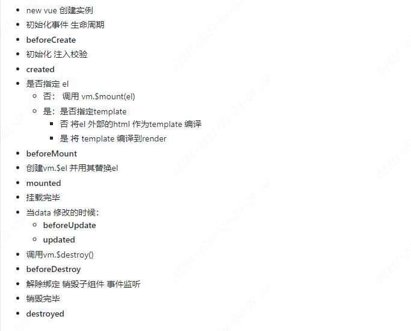

## Vue 面试知识点总结
可以阅读组件库源码哈 😄https://github.com/vueComponent/ant-design-vue

vue源码可以推荐两个：
https://ustbhuangyi.github.io/vue-analysis/
https://github.com/answershuto/learnVue

### 目录

### Vue基础
* [vue为什么说是一个构建用户界面的渐进式框架](#-vue为什么说是一个构建用户界面的渐进式框架)
* [vue的生命周期和每个生命周期所做的事情](#-vue的生命周期和每个生命周期所做的事情)
* [vm中data调用问题](#-vm中data调用问题)
* [v-if和v-show的区别](#-v-if和v-show的区别)
* [v-model的原理](#-v-model的原理)
* [template的使用](#-template的使用)
* [computed的实现原理](#-computed的实现原理)
* [computed和watch区别](#-computed和watch区别)
* [vue的虚拟DOM的理解](#-vue的虚拟DOM的理解)
* [vue的diff算法](#-vue的diff算法)
* [写 React / Vue 项目时为什么要在列表组件中写 key，其作用是什么?](#-写-React和Vue-项目时为什么要在列表组件中写-key，其作用是什么?)
* [为什么在Vue3.0采用了Proxy，抛弃了Object.defineProperty?](#-为什么在Vue3.0采用了Proxy，抛弃了Object.defineProperty)
* [Vue的响应式系统](#-Vue的响应式系统)
* [Vue组件通信的几种方式](#-Vue组件通信的几种方式)
* [vue和react的对比](#-vue和react的对比)
* [你是如何设计一个可扩展、通用的、健壮性组件！](#-你是如何设计一个可扩展-通用的-健壮性组件)
*

### Vuex
* [11. vue2和vue3中Vuex使用区别？](#11-vue2和vue3中Vuex使用区别)
* [12. 为什么Vuex的mutation和Redux的reducer中不能做异步操作](#12-为什么Vuex的mutation和Redux的reducer中不能做异步操作)
* [13. 为什么Vuex的store中的状态是响应式的?](#13-为什么Vuex的store中的状态是响应式的)
* [14. 双向绑定和单向数据流不冲突?](#14-双向绑定和单向数据流不冲突)
* [15. vuex中的数据在页面刷新以后消失怎么办？](#15-vuex中的数据在页面刷新以后消失怎么办)
*

### Vue-router
* [VueRouter的路由模式有几种](#-VueRouter的路由模式有几种)
* [VueRouter的路由模式hash和history的实现原理](#-VueRouter的路由模式hash和history的实现原理)
*
*
*
*


#### vue为什么说是一个构建用户界面的渐进式框架


**[:arrow_up: 返回目录](#目录)**

#### vue的生命周期和每个生命周期所做的事情
vue的生命周期分为四个阶段
1：实例创建
2：DOM渲染
3：数据更新
4：实例销毁
共有八个基本钩子函数
|		生命周期  |   描述   |
|    -       |     -    |
| beforeCreat | 在new一个vue实例之后，data和methods都还没有初始化，不能使用|
|  created    | data和methods都初始化好了，$el还没有，此阶段可以做的：解决loading，请求ajax数据为mounted渲染做准备|
| beforeMount | vue的$el和data都初始化了，但是还是虚拟的dom节点，具体的data.filter还没替换|
|  mounted    | 已挂载vue实例已经初始化完成了，data.filter成功渲染，配合路由钩子使用|
| beforeUpdate | data更新时触发|
|  updated     | 组件数据更新之后|
| beforeDestory | 实例销毁之前，实例仍可使用|
|  destroyed    | 组件销毁后调用 |
 


**[:arrow_up: 返回目录](#目录)**

#### vm中data调用问题
```javascript
// 我们的数据对象
var data = { a: 1 }

// 该对象被加入到一个 Vue 实例中
var vm = new Vue({
  data: data
})

// 获得这个实例上的 property
// 返回源数据中对应的字段
vm.a == data.a // => true
```

疑问：
为什么通过vm实例访问data对象属性a时，是直接vm.a，而不是vm.data.a？不是访问Vue实例对象vm下的data数据属性对应的data对象下的a属性么？

vue中定义的data在执行new Vue（）创建时候变为vue对象实例的属性，并给属性添加get和set方法，get和set操作的是原data对象

相关知识点：
>官网中说，当一个 Vue 实例被创建时，它将 data 对象中的所有的 property 加入到 Vue 的响应式系统中

**[:arrow_up: 返回目录](#目录)**

#### v-if和v-show的区别

v-if和v-show看起来似乎差不多，当条件不成立时，其所对应的标签元素都不可见，但是这两个选项是有区别的:
* 1.v-if在条件切换时，会对标签进行适当的创建和销毁，而v-show则仅在初始化时加载一次，因此v-if的开销相对来说会比v-show大。
* 2.v-if是惰性的，只有当条件为真时才会真正渲染标签；如果初始条件不为真，则v-if不会去渲染标签。v-show则无论初始条件是否成立，都会渲染标签，
* 它仅仅做的只是简单的CSS切换，改变的是display属性,block显示,none不显示

**[:arrow_up: 返回目录](#目录)**

#### v-model的原理
我们在vue项目中主要使用v-model指令在表单input、textarea和select等元素上创建双向数据绑定，v-model不过是语法糖，v-model在内部为不同的输入元素使用不同的
属性并抛出不同的事件:
* text和textarea元素使用value属性和input事件
* checkbox和radio使用check属性和change事件
* select字段将value做为prop并将change做为事件

**[:arrow_up: 返回目录](#目录)**

#### template的使用
在.vue文件中,template标签是用来写html模块的，且内部必须只有一个根元素，不然会报错
```javascript
<template>
    <div class="demo">
        .....
    </div>
</template>
```

<font color=red>template标签中不能使用v-show </font>

有时候,不需要这外层的 div ，可以采用下面 的方法，在 <template>标签上使用 v-for来循环
```js
<template>
    <div v-for="item,index in 5" :key="index">
			测试{{index}}
		</div>
</template>
```
**[:arrow_up: 返回目录](#目录)**

#### computed的实现原理
**1. computed的初衷**
就是为了解决模板中放入太多的声明式的逻辑时会让模板过重，增加对页面的可维护性

**2. computed的使用**
定义一个计算属性有两种写法，
	- 一种是直接跟一个函数
	- 另一种是添加get和set方法的对象形式


**[:arrow_up: 返回目录](#目录)**

#### computed和watch区别
**计算属性computed:**
* 支持缓存，已有依赖数据发生改变时，才会重新进行计算
* 不支持异步，当computed内有异步操作时无效，无法监听数据的变化
* computed属性值默认是走缓存的，也就是基于data中声明过的或者父组件传递的props中数据进行计算得到额值
* 如果computed属性属性值是函数，那么默认会走get方法，函数的返回值就是属性的属性值，

**侦听属性watch:**
* 不支持缓存，数据变化，直接会触发操作
* 支持异步
* 监听的函数接受两个参数，一个是最新的值，另一个是输入之前的值
* 监听数据必须是data中声明过的或者是父组件传递的props中的数据，数据变化触发操作，函数有两个参数

>immediate: 组件加载立即触发回调函数执行

```js
watch: {
  firstName: {
    handler(newName, oldName) {
      this.fullName = newName + ' ' + this.lastName;
    },
    // 代表在wacth里声明了firstName这个方法之后立即执行handler方法
    immediate: true
  }
}
```
>deep: deep的意思就是深入观察，监听器会一层层的往下遍历，给对象的所有属性都加上这个监听器，但是这样性能开销就会非常大了，
>任何修改obj里面任何一个属性都会触发这个监听器里的 handler
```js
watch: {
	'obj': {
		handler(newVal, oldVal) {
			consloe.log('obj.a is change')
		},
		immediate: true,
		deep: true
	}
}
```
优化我们可以使用字符串的形式进行监听
```js
watch: {
	'obj.a': {
		handler(newVal, oldVal) {
			consloe.log('obj.a is change')
		},
		immediate: true,
		//deep: true
	}
}
```
**[:arrow_up: 返回目录](#目录)**

#### vue的虚拟DOM的理解


**[:arrow_up: 返回目录](#目录)**

#### vue的diff算法

**[:arrow_up: 返回目录](#目录)**

#### 写 React和Vue 项目时为什么要在列表组件中写 key，其作用是什么?
key的特殊属性是在虚拟DOM的算法中，在新旧node对比时辨识VNodes。key的作用是子更新组件时更准确更快的判断两个节点是否相同，相同就复用，不相同就删除旧的创建新的

Vue官方文档：
>这个默认的模式是高效的，但是只适用于不依赖子组件状态或临时 DOM 状态 (例如：表单输入值) 的列表渲染输出。

默认模式就是Vue在使用v-for渲染元素时，默认会采用`就地复用更新`的策略  
```js
var vm = new Vue({
  el: '#app',
  data: {
    dataList: [1, 2, 3, 4, 5]
  }
})
vm.dataList = [3, 4, 5, 6, 7] // 数据进行增删

// 1. 没有key的情况， 节点位置不变，内容也更新了
[
  '<div>3</div>', // id： A
  '<div>4</div>', // id:  B
  '<div>5</div>', // id:  C
  '<div>6</div>', // id:  D
  '<div>7</div>'  // id:  E
]

// 2. 有key的情况， 节点删除了 A, B 节点，新增了 F, G 节点
// <div v-for="i in dataList" :key='i'>{{ i }}</div>
[
  '<div>3</div>', // id： C
  '<div>4</div>', // id:  D
  '<div>5</div>', // id:  E
  '<div>6</div>', // id:  F
  '<div>7</div>'  // id:  G
]
```

>官方建议尽可能在使用 v-for 时提供 key attribute，除非遍历输出的 DOM 内容非常简单，或者是刻意依赖默认行为以获取性能上的提升。

在项目大多数使用情境下，列表组件都是用自己的状态的
**举个例子**：一个新闻列表，可点击列表项来将其标记为"已访问"，可通过tab切换“娱乐新闻”或是“社会新闻”。

不带key属性的情况下，在“娱乐新闻”下选中第二项然后切换到“社会新闻”，"社会新闻"里的第二项也会是被选中的状态，因为这里复用了组件，保留了之前的状态。
要解决这个问题，可以为列表项带上新闻id作为唯一key，那么每次渲染列表时都会完全替换所有组件，使其拥有正确状态。


**[:arrow_up: 返回目录](#目录)**


#### 为什么在Vue3.0采用了Proxy，抛弃了Object.defineProperty
1. Object.defineProperty无法监控到数组下标的变化，导致通过数组下标添加元素，不能实时响应；

>Object.defineProperty无法监控到数组下标的变化，导致直接通过数组的下标给数组设置值，不能实时响应。 
为了解决这个问题，经过vue内部处理后可以使用以下几种方法来监听数组(push, pop, shift, unshift, splice, sort, reverse)

由于只针对了以上七种方法进行了hack处理,所以其他数组的属性也是检测不到的，还是具有一定的局限性。
```
PS：尤大说了vue针对数组数组下标动态响应不是做不到，而是因为性能不做
数组length 尽量不能去改写。

length 在规范中不允许改写，configurable = false
a.length = 100，等于增加了 100 个属性，需要对每个属性进行监听，这样一来，性能上所有问题，使用 push 或者 pop 等重写方法更加简单
```

2. Object.defineProperty只能劫持对象的属性，从而需要对每个对象，每个属性进行遍历，如果，属性值是对象，还需要深度遍历。
3. Proxy不仅可以代理对象，还可以代理数组, 可以劫持整个对象并返回对象。还可以代理动态增加的属性。


参考链接：《[实现双向绑定Proxy比defineproperty优劣如何?](https://juejin.cn/post/6844903601416978439)》

**[:arrow_up: 返回目录](#目录)**


#### Vue的响应式系统
Vue称其为非侵入式响应式系统，数据模型仅仅是普通的 javascript 对象，当你修改他们时，视图会自动更新。
Vue 2.X 采用的是 Object.defineProperty 把这些属性全部转化为getter/setter
Vue 3.0 采用的是 ES6 Proxy 

**介绍下Vue 2.X**
在Vue 2.x的响应式系统中，其核心有三点，observe, watcher, dep:
* observe: 遍历data中的属性，使用 Object.defineProperty 的 get/set 方法对其进行数据劫持
* dep: 每个属性拥有自己的消息订阅器dep，用于存放所有订阅了该属性的观察者对象
* watcher: 观察者(对象)，通过dep实现对响应属性的监听，监听到结果后，主动触发自己的回调进行响应

**[:arrow_up: 返回目录](#目录)**


#### Vue组件通信的几种方式

传送门: 《[Vue组件通信的几种方式](https://github.com/BGround/Web-Front-End-Interview/blob/main/Vue/Vue组件通信的几种方式.md)》

**[:arrow_up: 返回目录](#目录)**


#### vue和react的对比

参考链接：《[关于Vue和React的一些对比及个人思考（上）](https://juejin.cn/post/6844904040564785159#heading-25)》
**[:arrow_up: 返回目录](#目录)**

-----------------------------------------------------------------------------

#### vue2和vue3中Vuex使用区别
两者核心区别就是类型提示，像定义组件需要 defineComponent 同出一辙：
```js
/**   vue3    ***/
import { createStore } from "vuex";

import example from './modules/example'

export default createStore({
  state: {},
  mutations: {},
  actions: {},
  modules: { example }
})

/**   vue2    ***/
import Vue from "vue";
import Vuex from "vuex";

Vue.use(Vuex);

export default new Vuex.Store({
  state: {},
  mutations: {},
  actions: {},
  modules: {}
});

```

**[:arrow_up: 返回目录](#目录)**


#### 为什么Vuex的mutation和Redux的reducer中不能做异步操作
分析一下mutation必须是同步函数的原因，是因为devtool插件需要跟踪记录每一条mutation日志，每一条 mutation 被记录，devtools 都需要捕捉到前一状态和后一状态的快照
如果mutation中使用异步函数操作，当mutation被触发时，回调函数还没有被调用的话，devtools就无法知道回调函数什么时候结束，也就无法无法追踪store中state，这与vuex设计
的初衷不符
**[:arrow_up: 返回目录](#目录)**

#### 为什么Vuex的store中的状态是响应式的

14-双向绑定和单向数据流不冲突

**[:arrow_up: 返回目录](#目录)**

#### 双向绑定和单向数据流不冲突
双向绑定是使用v-model实现，它知识一种语法糖，为了写更少的代码，实质上还是单向数据流
当在严格模式中使用 Vuex 时，在属于 Vuex 的 state 上使用 v-model 会比较棘手：
现有两种解决方法：
 * 给 <input> 中绑定 value，然后侦听 input 或者 change 事件，在事件回调中调用一个方法:
 * 双向绑定的计算属性
**[:arrow_up: 返回目录](#目录)**

#### vuex中的数据在页面刷新以后消失怎么办
1.采用将store中数据存储到本地浏览器sessionStorage中
```js
//在页面加载时读取 sessionStorage 里的状态信息
if (sessionStorage.getItem("store") ) {
 this.$store.replaceState(Object.assign({},this.$store.state,JSON.parse(sessionStorage.getItem("store"))))     
} 
//在页面刷新时将 vuex 里的信息保存到 sessionStorage 里
window.addEventListener("beforeunload",()=>{
  sessionStorage.setItem("store",JSON.stringify(this.$store.state))
}
```
2.解决 vuex 刷新数据初始化问题  vuex-persistedstate  采用 h5 本地缓存的原理  可以自定义为永久缓存和会话级缓存，这两种方式缓存方式可一起使用。 
 看项目需求而定  建议 会话级缓存  因为 h5 本地缓存储存方式没有对 xss 攻击有任何抵御机制，一旦出现 xss 漏洞 信息就会泄露
**[:arrow_up: 返回目录](#目录)**


-----------------------------------------------------------------------------

#### VueRouter的路由模式hash和history的实现原理
1. hash 模式的实现原理

早期的前端路由的实现事基于 location.hash 来实现的。其实现原理很简单，location.hash 的值就是 URL 中 # 后面的内容，比如下面这个网站，它的 location.hash 的值就是 #search
**https://www.baidu.com#search**

hash 路由模式的实现主要是基于以下几个特性：

 - URL中 hash 值只是客户端的一种状态，也就是说当向服务器发出请求时，hash部分不会被发送
 - hash 值的改变，都会在浏览器的访问历史中留下记录，因此我们通过浏览器的回退、前进按钮控制 hash 的切换
 - 可以通过 a 标签，并设置 href 属性，当用户点击这个标签后，URL 的 hash 值会发生改变，或者使用 JavaScript 来对 location.hash 进行赋值，改变URL的hash值
 - 我们可以使用 hashchange 事件来监听 hash 值的变化， 从而对页面进行跳转

2. history模式的实现原理

HTML5提供了History API来实现 URL 的变化，其中最主要的API有以下两个：history.pushState() 和 history.replaceState().
这两个API可以在不进行刷新的情况下，操作浏览器的历史记录。唯一不同的是，前者是新增一个历史记录，后者是直接替换当前的历史记录，如下所示：
```
window.history.pushState(null, null, path)
window.history.replaceState(null, null, path)
```

history 路由模式实现主要是基于以下几个特性：

- pushState 和 replaceState 两个API来操作实现 URL 的变化
- 我们可以使用 popstate 事件来监听 URL的变化，从而对页面进行跳转
- history.pushState() 和 history.replaceState() 不会触发 popstate 事件，这是需要我们手动出发页面更新

3. 简单实现 Vue Router

Vue Router 核心是，通过 Vue.use 注册插件，在插件的 install 方法中获取用户配置的 router 对象，当浏览器地址发生变化的时候，
根据 router 对象匹配相应路由，获取组件，并将组件渲染到视图上

**(1) 如何在 install 方法中获取 Vue 实例上的 router 属性**

可以利用 Vue.mixin 混入声明周期函数 beforeCreate，在beforeCreate 函数中可以获取到Vue实例上的属性并赋值到Vue原型链上
```
_Vue.mixin({
	beforeCreate() {
		if (this.$options.router) {
			_Vue.protoType.$router = this.$options.router
		}
	}
})
```

**(2) 如何触发更新**

hash 模式下：

- 通过 history.pushState() 修改浏览器地址，触发更新
- 通过监听 hashchange 事件来监听浏览器前进或者后退，触发更新

history模式下：

- 通过 location.hash 修改 hash 值，触发更新
- 通过监听 popstate 事件来监听浏览器前进或者后退，触发更新
- 渲染 router-view 组件

**[:arrow_up: 返回目录](#目录)**

